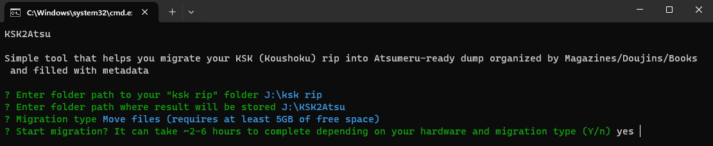

# KSK2Atsu

*Disclaimer: we DO NOT support piracy! Use this app only with legally obtained content. There is no links to any **pirated** content. If you brave enough, find them by yourself!*

### Description

<p align="center">
  
</p>

Very simple ```Java 17+``` CLI app that helps with migrating ```ksk rip```  (```238.07 GB``` of manga originally posted on ```Sukebei```) into [Atsumeru](https://github.com/AtsumeruDev/Atsumeru) rails

This app will parse over all files, resort them into ```Magazines```, ```Doujins``` and ```Books``` folders, download covers for ```Magazines```, find and inject ```book_info.json``` metadata into all archives

After that, result folder will be perfectly organized for importing into [Atsumeru self-hosted manga/comics server](https://github.com/AtsumeruDev/Atsumeru)

*Note: app is intended to be used with ```ksk rip``` but **may** work with other ```F*KKU``` dumps*

### How to use

**App requires ```JRE/JDK 17+``` in order to run!**

Download latest ```*.jar``` file from [Releases](https://github.com/AtsumeruDev/KSK2Atsu/releases) and simply double-click on it or run in terminal with command:  
```java -jar KSK2Atsu-x.y.jar```, where ```x.y``` - version of app

After that you will see simple interactive console UI. Answer required questions, seat back and just wait when magick happens!

### How to build

Execute ```gradlew shadowJar``` task. It will produce jar file that can be launched with any ```JRE/JDK 17+``` with no additional dependencies
